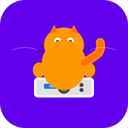
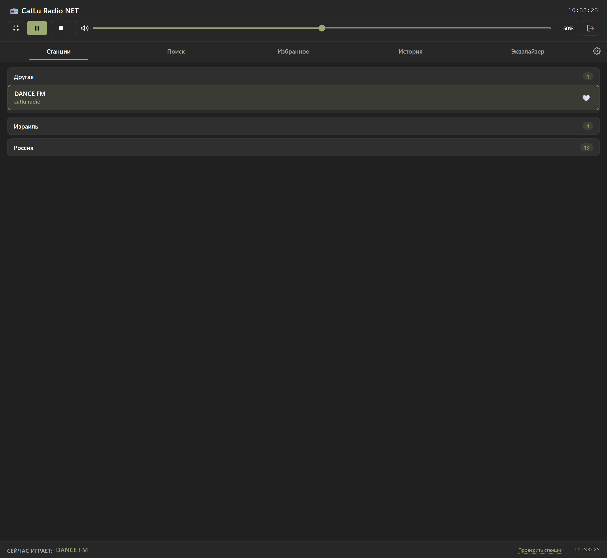
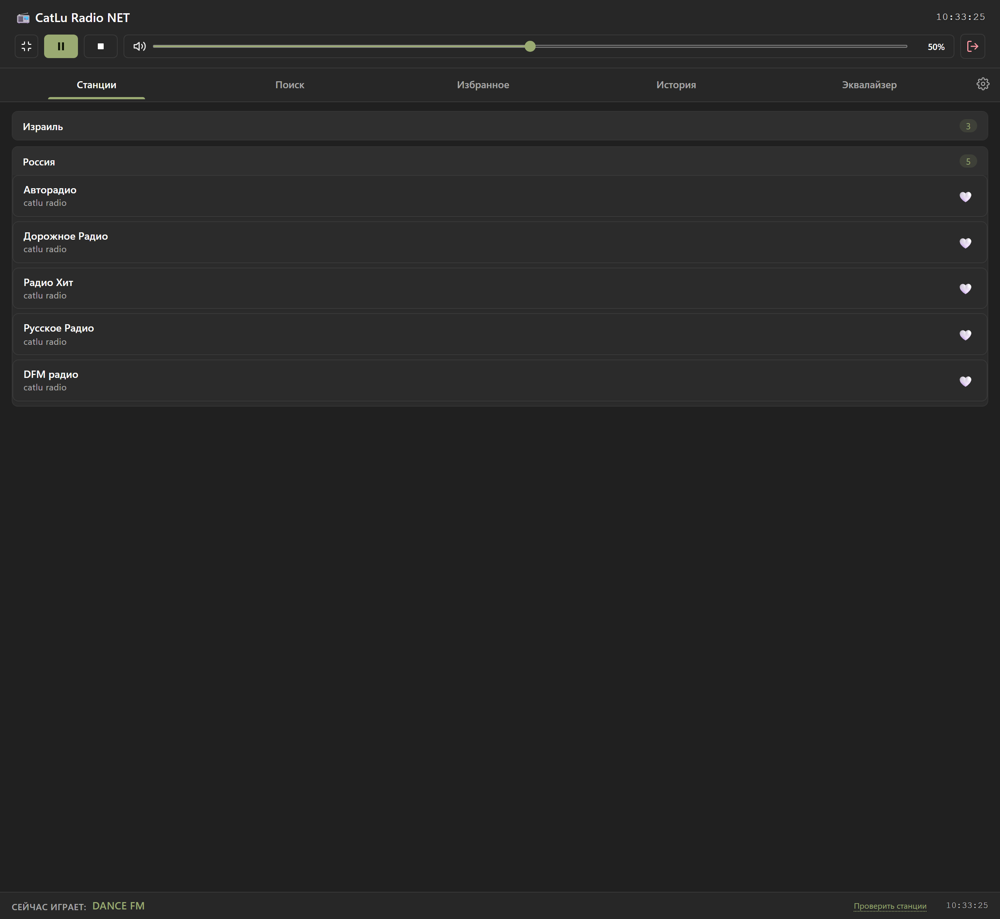
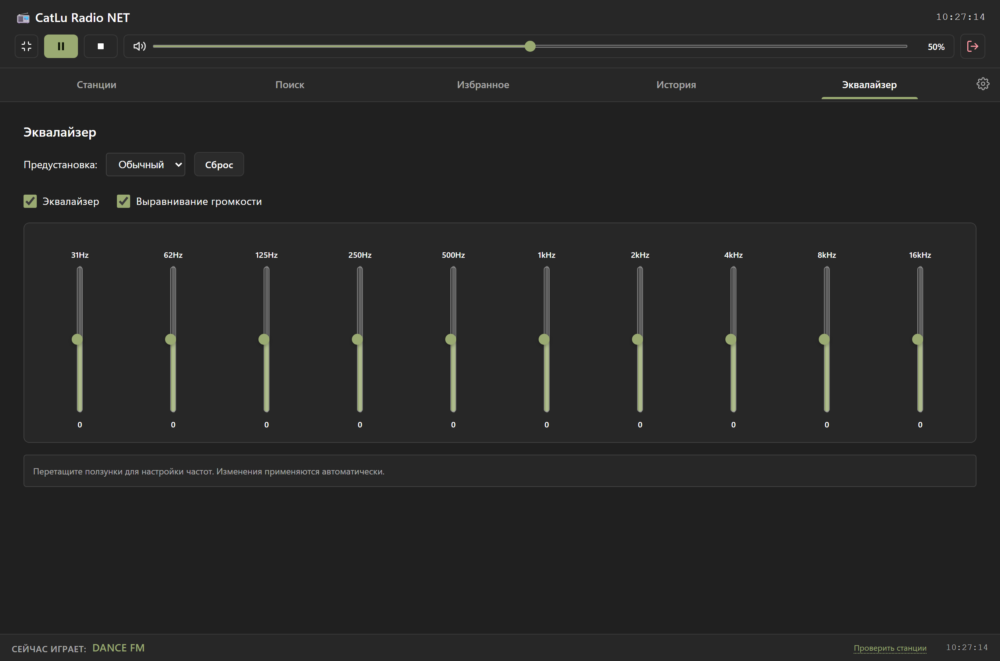
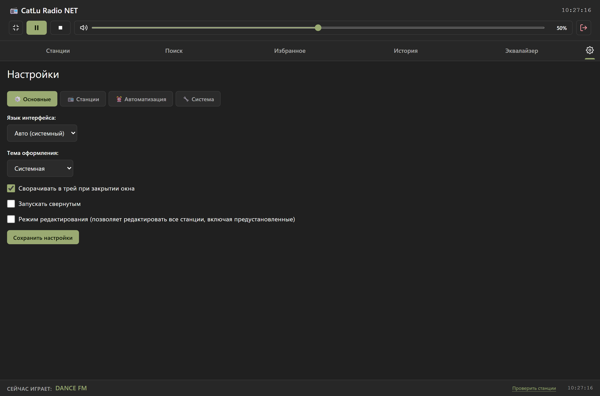
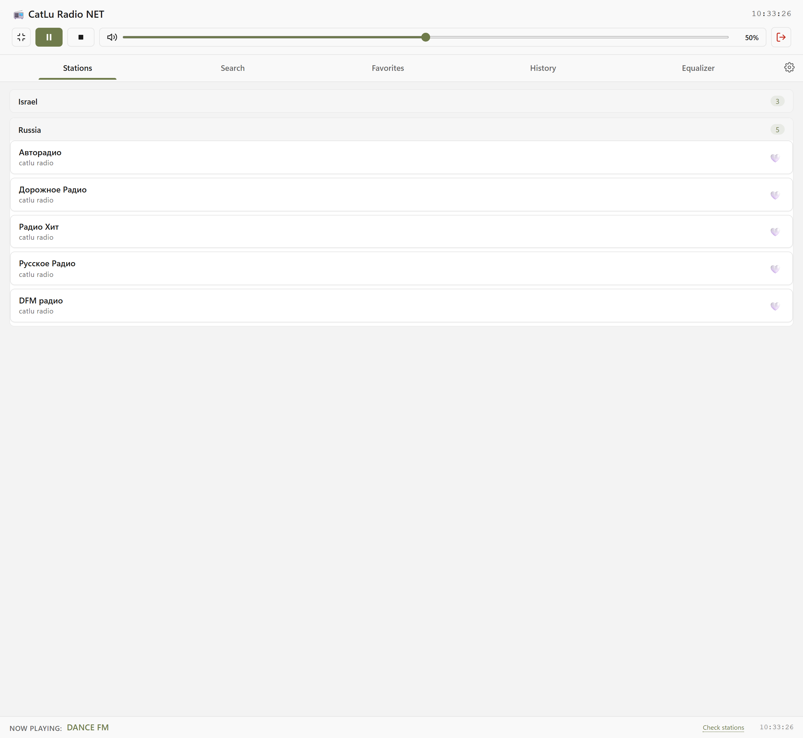
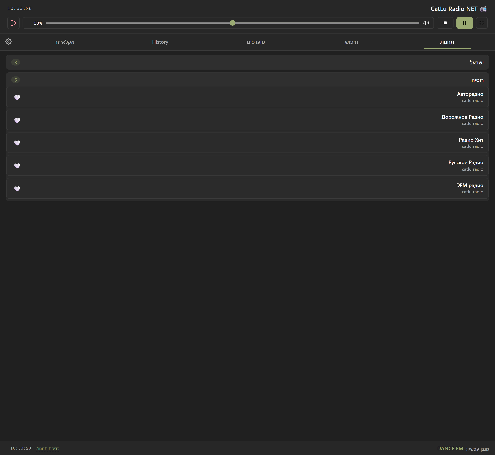

<div align="center">



# 📻 CatLu Radio NET

**Настольный плеер интернет-радио для Windows**

Поиск по семи порталам ❤️ избранное и история 🎚️ 10-полосный эквалайзер ⏰ расписания и таймер сна 🌍 четыре языка — в одном окне в стиле Windows 11

<br>


<br>

<a href="#-возможности">✨ Возможности</a> •
<a href="#-скриншоты">🖼 Скриншоты</a> •
<a href="#-установка">📦 Установка</a> •
<a href="#️-запуск-из-исходников">▶️ Запуск</a> •
<a href="https://github.com/Maksimasz/CatLuRadio-Updates/releases/latest">🚀 Скачать</a>

</div>

---

## ✨ Возможности

- 📻 **Плеер** — потоки HTTP/HTTPS и HLS (`.m3u8`) на LibVLC + Web Audio: чистый звук, плавный crossfade и **резервные потоки**, если основной канал недоступен.
- 🔎 **Поиск станций** — локальный фильтр по названию и стране в списке, онлайн-поиск сразу по нескольким популярным порталам радиостанций.
- ❤️ **Избранное** — сердечко в один клик; станцию можно **прослушать перед добавлением** в избранное.
- 🕘 **История прослушивания** — всё, что вы слушали, легко найти снова.
- 🎚️ **10-полосный эквалайзер** — 31 Гц…16 кГц, пресеты, сброс и **выравнивание громкости**; ползунки применяются на лету.
- ⏰ **Автоматизация** — расписания включения/выключения и таймер сна: приложение само включит музыку утром и усыпит её ночью.
- 🌍 **4 языка интерфейса** — English, Русский, Lietuvių, עברית; **автоопределение системного языка** (если системного нет — English) и полноценный **RTL-режим** для иврита.
- 🎨 **Темы** — системная, светлая или тёмная; интерфейс в стиле Windows 11 с адаптивной вёрсткой.
- 🖥 **Мини-плеер** — сверните окно в компактный плеер и управляйте воспроизведением, не отвлекаясь.
- 🔄 **Автообновления** — проверка при запуске и установка новой версии одной кнопкой (Настройки → Система).
- ⚙️ **Полное управление станциями** — добавление, редактирование, удаление, импорт/экспорт и режим редактирования всех станций.

## 🖼 Скриншоты

| Станции — главный экран |
|:---:|
|  |

| 🔎 Поиск по списку | 🎚️ Эквалайзер |
|:---:|:---:|
|  |  |

| ⚙️ Настройки — саб-табы |
|:---:|
|  |

| 🇬🇧 Светлая тема, English | 🇮🇱 Иврит, RTL-режим |
|:---:|:---:|
|  |  |

## 🌍 Языки

| Режим | Что делает |
|---|---|
| **Авто (системный)** | Определяет язык Windows при запуске |
| **English / Русский / Lietuvių / עברית** | Фиксированный выбор, хранится в настройках |

Словари охватывают весь интерфейс: вкладки, настройки, эквалайзер, расписания, тосты и диалоги. Названия станций и языков не переводятся — они всегда отображаются как есть. Для иврита интерфейс автоматически зеркалится (RTL).

Переключатель — **Настройки → Основные → Язык интерфейса**.

## 📦 Установка

1. Откройте **[последний выпуск](https://github.com/Maksimasz/CatLuRadio-Updates/releases/latest)** и скачайте установщик последней версии.
2. Запустите его и следуйте подсказкам (приложение ставится в `Program Files`, ярлык появится в меню «Пуск»).
3. **Обновление поверх старой версии** сохраняет все станции, избранное, историю и настройки.

> Приложение автономное (self-contained): .NET SDK для запуска **не нужен** — достаточно Windows и WebView2 Runtime (на Windows 11 он уже встроен).

Внутри приложения автообновление живёт в **Настройки → Система → Проверить обновления**.

## ▶️ Запуск из исходников

Требования: Windows 10/11 x64, [.NET 8 SDK](https://dotnet.microsoft.com/download/dotnet/8.0), WebView2 Runtime.

```powershell
git clone https://github.com/Maksimasz/CatLuRadio-Updates.git
cd CatLuRadio-Updates
dotnet run
```

Сборка релиза и установщика (нужен [Inno Setup 6](https://jrsoftware.org/isinfo.php)):

```powershell
dotnet publish -c Release -r win-x64 --self-contained true
iscc installer\CatLuRadio.iss   # результат — release/CatLuRadio-*-Standalone-Setup-desktop.exe
```

## 🧪 Тесты

Пять наборов на Node.js — запускаются по одному:

```powershell
node tests\line-endings.test.js            # LF в файлах, от которых зависят grep-проверки
node tests\version-consistency.test.js     # <Version> в csproj ↔ ?v= в index.html ↔ «О программе»
node tests\playback-guard.test.js          # защита логики воспроизведения
node tests\equalizer-normalization.test.js # эквалайзер и нормализация громкости
node tests\api-adapter-timeout.test.js     # таймауты моста WebView2
```

## 🗂 Структура проекта

```
CatLuRadio/
├── CatLuRadio.csproj          # .NET 8 · WinForms · WebView2 · LibVLC
├── MainForm.cs, Program.cs    # окно приложения, хост WebView2, LibVLC
├── wwwroot/                   # весь интерфейс — чистые HTML/CSS/JS
│   ├── index.html             # разметка: шапка, вкладки, панели
│   ├── styles.css             # палитра Windows 11, светлая/тёмная темы
│   ├── js/renderer.js         # логика плеера, вкладок, избранного, истории
│   ├── js/api-adapter.js      # мост WebView2 (в браузере — безопасный фолбэк)
│   └── modules/               # TranslationManager · ThemeManager · Equalizer …
├── installer/CatLuRadio.iss   # скрипт Inno Setup
├── tests/                     # 5 наборов node-тестов
├── docs/screenshots/          # скриншоты для этого README
└── _history/                  # дневник развития проекта
```

## 📋 Требования

- Windows 10 (1607+) или Windows 11, **x64**
- WebView2 Runtime — на Windows 11 встроен, для Windows 10 [скачивается отдельно](https://developer.microsoft.com/microsoft-edge/webview2/)
- Доступ в интернет — для поиска станций и потоков

## 🔗 Ссылки

- 🚀 [Скачать последнюю версию](https://github.com/Maksimasz/CatLuRadioNET/releases/latest)
- 📦 [Все релизы](https://github.com/Maksimasz/CatLuRadioNET/releases)
- 🐛 [Задачи и обновления](https://github.com/Maksimasz/CatLuRadioNET/issues)

## 📝 Версии

- **3.5.1** — «CatLu Radio NET»: редизайн под Windows 11, мультиязычность EN/RU/LT/HE с автоопределением и RTL, саб-табы в настройках, этот README со скриншотами.
- **3.5.0** — 10-полосный эквалайзер с Web Audio, доработки воспроизведения, решение проблем с автозапуском.
---
Проект поставляется «как есть» и является полностью бесплатным.
---

<sub>Лицензия ISC · Сделано с ❤️ для тех, кто любит радио</sub>
